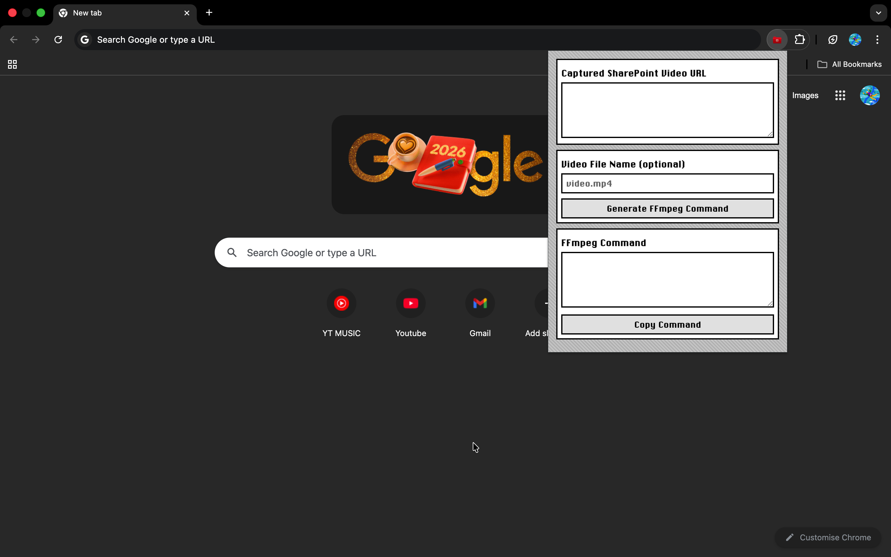
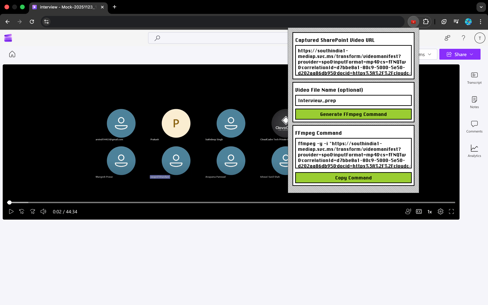
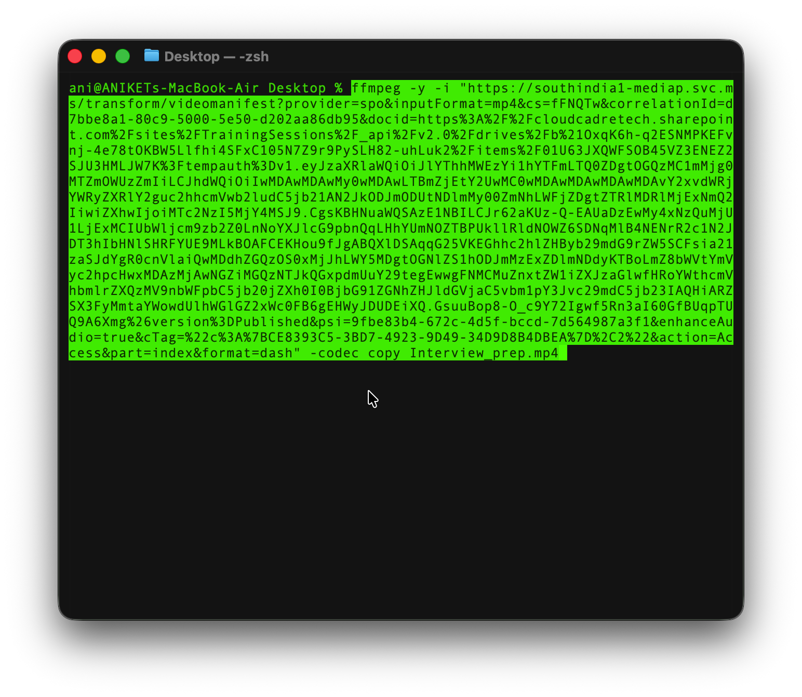

# 📹 SharePoint Save


**SharePoint Save** is a Chrome extension that captures SharePoint video stream URLs and generates ready-to-use FFmpeg commands to download videos you have access to.

> ⚠️ This extension does NOT download videos directly and does NOT bypass DRM or permissions.

---

## 🖼️ Screenshots

<p>
Below are screenshots demonstrating installation and usage.
</p>

<h3>1. Chrome Extension Popup</h3>


<h3>2. Captured SharePoint Video URL and Generated FFmpeg Command</h3>


<h3>3. FFmpeg Download in Terminal</h3>


---

## 1️⃣ Install FFmpeg

### Windows
- Download: https://www.gyan.dev/ffmpeg/builds/
- Add `bin` folder to PATH
- Verify:
```bash
ffmpeg -version
```

Video: https://www.youtube.com/watch?v=IECI72XEox0

### macOS
- Download: https://ffmpeg.martin-riedl.de/
```bash
ffmpeg -version
```

Video: https://www.youtube.com/watch?v=8Q9jG4l4Npo

### Linux
```bash
sudo apt install ffmpeg
```

Video: https://www.youtube.com/watch?v=E0z6OZ6x0fI

---

## 2️⃣ Install Chrome Extension

1. Download this repo
2. Open `chrome://extensions`
3. Enable **Developer mode**
4. Click **Load unpacked**
5. Select `SharePoint Save` folder

---

## 3️⃣ Capture SharePoint Video URL

1. Refresh SharePoint video page
2. Click **Play**
3. Wait 2–3 seconds
4. Open extension

---

## 4️⃣ Generate FFmpeg Command

Example:
```bash
ffmpeg -i "VIDEOMANIFEST_URL" -codec copy MyVideo.mp4
```

---

## 5️⃣ Download Video

### Windows
```cmd
cd Downloads
```

### macOS / Linux
```bash
cd ~/Downloads
```

Paste command and press Enter.

---